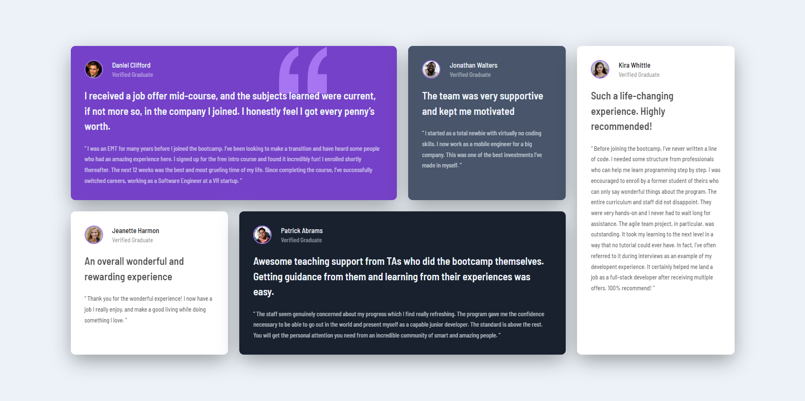

# Frontend Mentor - Testimonials grid section solution

This is a solution to the [Testimonials grid section challenge on Frontend Mentor](https://www.frontendmentor.io/challenges/testimonials-grid-section-Nnw6J7Un7). Frontend Mentor challenges help you improve your coding skills by building realistic projects. 

- Solution URL: [Solution](https://www.frontendmentor.io/solutions/responsive-testimonials-grid-section-RYc0ot-3Bz)
- Live Site URL: [Live Site](https://anubis356.github.io/Testimonials-grid-section/public/)

They Didn't Ask For Typescript so i used it

## Table of contents

- [Screenshot](#screenshot)
- [Built with](#built-with)
- [Author](#author)
- [Acknowledgments](#acknowledgments)

### Screenshot

### Built with

- Semantic HTML5 markup
- CSS
- Sass (CSS Pre-processor)
- Typescript (DOM, Fetch Api, Promises, Types)
- Flexbox
- CSS Grid
- Mobile-first workflow*

### Author

- Frontend Mentor - [@anubis356](https://www.frontendmentor.io/profile/anubis356/)
- Twitter - [@hellorapio](https://www.twitter.com/hellorapio)

### Acknowledgments

- [Brad Traversy](https://www.youtube.com/c/TraversyMedia)
- [Jack Herrington](https://www.youtube.com/c/JackHerrington)
